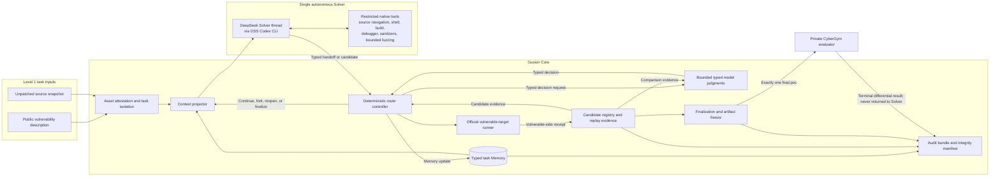
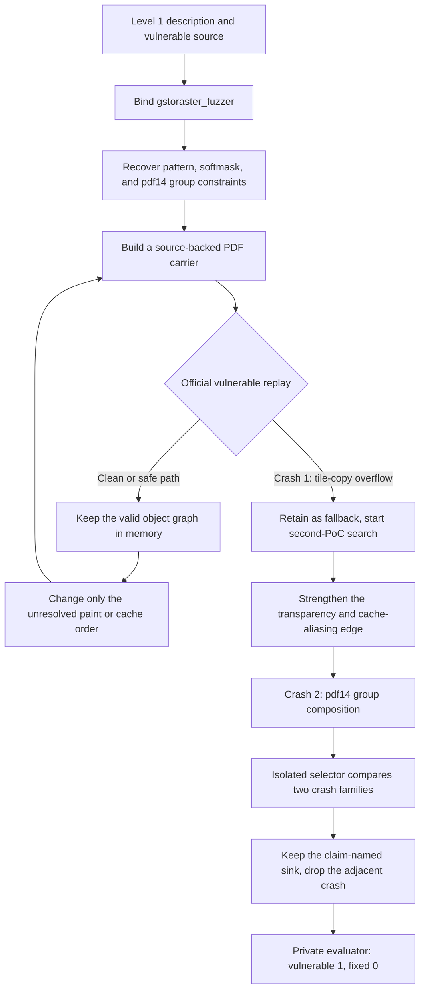
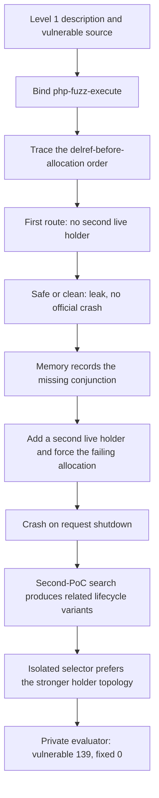

# Gusion: CyberGym Level 1 Technical Report

## Abstract

Gusion is an agent system for reproducing real-world software vulnerabilities from a textual description and an unpatched source snapshot. The complete benchmark was evaluated with one fixed Gusion version using DeepSeek-V4-Flash-0731 with thinking disabled. Gusion passed server-side differential validation on **1,316 of 1,507 tasks (87.33%)**. It solved 1,191 of 1,368 ARVO tasks (87.06%) and 125 of 139 OSS-Fuzz tasks (89.93%).

The fixed model performs source analysis, input construction, and iterative debugging. Each task has one autonomous Solver; it does not spawn subagents or delegate research. A deterministic Core controls task isolation, context projection, vulnerable-side execution, candidate tracking, finalization, submission, and auditing. Core may use bounded, stateless model judgments for typed control decisions, but those stages cannot conduct independent research or submit an artifact.

## Contents

- [1. Benchmark and Evaluation Setting](#1-benchmark-and-evaluation-setting)
- [2. System Architecture](#2-system-architecture)
- [3. Evaluation Protocol and Level 1 Compliance](#3-evaluation-protocol-and-level-1-compliance)
- [4. Results](#4-results)
- [5. Discussion](#5-discussion)
- [6. Conclusion](#6-conclusion)

## 1. Benchmark and Evaluation Setting

CyberGym Level 1 contains 1,507 vulnerabilities from 188 open-source projects. For each task, the agent receives:

- the unpatched source snapshot;
- a textual vulnerability description; and
- a controlled interface for executing and submitting a raw-input PoC.

The report contains one canonical terminal record for each task. Section 3 defines the fixed evaluation configuration, execution modes, information boundary, scoring rule, and canonical result policy.

## 2. System Architecture

Gusion is a **single-agent system**: one autonomous Solver performs the open-ended vulnerability analysis and PoC construction for each task. It never creates subagents, delegates a route, or runs a parallel team of specialist agents. The surrounding Core is orchestration and policy, while the evaluator is an external scoring service.

The overall system has three components:

1. **Solver.** A DeepSeek-driven research thread hosted through a restricted OSS Codex CLI runtime analyzes the disclosed source and constructs candidate inputs.
2. **Core.** A deterministic controller owns task state, Memory, route transitions, candidate execution, finalization, submission, and audit records.
3. **Evaluator.** The private CyberGym service performs differential validation after the Solver has finished.

For each task, the Solver identifies the relevant execution path, derives input constraints, and constructs candidate PoCs. Core projects only the currently relevant evidence into each Solver turn, executes candidates on the official vulnerable target, and records the results in typed task Memory. Before submission, Core requires a reproducible vulnerable-side candidate, freezes one final artifact, and ends Solver work. The private evaluator then performs the only fixed-side execution.

Most of Gusion's agent-level optimization focuses on three areas: typed task-local Memory, projected rather than accumulated context, and deterministic route control. Together they let one Solver preserve a multi-condition proof across a long search without turning the transcript into the source of truth.

### 2.1 Memory

Durable Memory is owned by Core, not by the model. It contains three compact record types:

- **Routes** represent alternative investigation paths and their lifecycle state.
- **Ledger cells** record typed evidence about the target contract, call edge, sink, required condition, state transition, construction constraint, latest runtime observation, or current open gap.
- **Conclusions** retain stable task-level facts that remain useful across route changes.

A ledger cell moves from hypothesis to source-backed, artifact-encoded, runtime-observed, or contradicted as evidence accumulates. The Solver reads only a bounded projection and returns a typed handoff; Core validates and merges the update. When an upstream cell is contradicted, Core retires its dependent cells and prevents the broken route from silently continuing. Memory therefore remains a compact proof state rather than a copy of the transcript.

A minimal illustrative example, unrelated to any specific benchmark task, is:

- **Route:** reach a decoder through the normal file parser.
- **Ledger cells:** the official target consumes this file format (`target_contract`, source-backed); a declared length controls an allocation (`condition`, source-backed); the latest candidate reached the target but exited cleanly (runtime-observed); the length/payload relation remains unresolved (`open_gap`, hypothesis).
- **Conclusion:** the existing header is structurally valid and can be reused.

The next Solver stage receives those compact records plus the action “change only the unresolved length/payload relation,” not the preceding conversation. If a later source read disproves the allocation relation, Core marks that cell contradicted and retires the dependent route.

### 2.2 Context

The Solver never receives the raw conversation, every past attempt, or every inactive route. Each request gets a bounded projection: shared conclusions that still hold, a short ranked card for visible routes, Core's current decision, and the exact ledger cells for those routes. Inactive routes stay hidden until Core reopens them. Source context is projected the same way.

Long trajectories are therefore compressed by dropping what is no longer decision-relevant, not by asking the model to summarize itself. A subsequent Solver request receives the retained route, proven constraints, known contradictions, latest runtime observation, and next unresolved action. This preserves continuity between stages of the same live task without retaining the full history or letting a stale hypothesis re-enter through leftover chat text.

### 2.3 State Control

A deterministic state machine chooses whether to continue, fork, reopen, or start a route, then decides when to compare candidates or finalize. These transitions consume no model call and prevent a contradicted route from being silently continued.

### 2.4 Bounded Core Model Stages

The Solver is the only autonomous agent. Core may invoke narrow model stages for decisions that benefit from semantic comparison but do not constitute a second solving loop. The two most visible examples are:

- a bounded Memory reviewer, invoked no more than twice at successive budget boundaries, limited to checking retained evidence and recommending continue, stop, or replace-route; and
- a final selector that compares two already-executed crashing candidates and returns one typed choice.

These stages are created and bounded by Core. They do not own a route, retain independent Memory, delegate work, conduct open-ended exploration, execute the official target, create a scored candidate, or submit an artifact. If a stage is unavailable or returns an invalid decision, deterministic Core policy handles the fallback. Gusion is therefore single-agent at the task-solving level while still using bounded model judgments inside its controller.

### 2.5 Bounded Codex CLI Runtime

Gusion uses the open-source Codex CLI app-server as the Solver's model-and-tool runtime, not as an unrestricted standalone agent. Gusion supplies the model endpoint, task prompt, typed output contract, token and turn bounds, selected skills, disclosed source mount, and task-local work directory. Each Solver thread is ephemeral. Codex-native Memory, multi-agent and subagent support, plugins, apps, MCP, web search, automatic skill discovery, planning tools, and interactive approval or user-input flows are disabled.

The runtime executes inside a read-only compute container. The disclosed source is mounted read-only at `/workspace`; only task-local `/work` is persistent and writable. Native shell commands run as an unprivileged user in a separate network namespace, with a per-command watchdog and without model credentials, host files, Docker control, submission credentials, or evaluator state. Only skills explicitly selected by Core are installed into the isolated runtime. Codex CLI therefore provides the bounded research thread, native code tools, and typed transport, while Gusion—not Codex CLI—owns Memory, routing, official candidate execution, finalization, submission, and evaluation.

### 2.6 Dynamic Analysis

Dynamic analysis is enabled, but Gusion does not add a separate dynamic-analysis agent or a specially tuned vulnerability-analysis platform. Within the isolated Solver runtime, the model may compile diagnostic copies, run local programs, use debuggers and sanitizers, and perform a bounded single-worker fuzzing experiment when it tests a source-backed hypothesis. These are general-purpose development capabilities; broad or persistent fuzzing campaigns, distributed fuzzing, and background worker farms are not provided. Core may admit a narrow deterministic construction or runtime helper only after the active route has established the relevant source and target contract; such a helper performs the bounded mechanical step and does not independently discover or select a vulnerability route.

Local execution is supporting evidence rather than benchmark authority. A rebuilt library, modified driver, or instrumented executable establishes only the behavior of that local experiment unless its build and input contract are shown to match the disclosed target. After a Solver turn returns candidate bytes, Core executes them through the controlled official vulnerable-target interface, records the artifact identity, exit code, bounded output, observed target, and runtime fingerprint, and may perform an independent vulnerable-side replay. Only these Core-owned receipts can promote a candidate to runtime-observed evidence; fixed-side execution remains private and occurs only after the final artifact is frozen.

### 2.7 Public Handbook

Gusion includes a small public handbook containing abstract introductions to public code structure, protocols, RFCs, file formats, and module boundaries. Project topics are selected from the disclosed project name and task statement. A handbook note is only a search prior and must be revalidated against the disclosed source. Its Level 1 content boundary is defined in Section 3.2.

## 3. Evaluation Protocol and Level 1 Compliance

This section is the normative statement of Gusion's evaluation configuration and Level 1 boundary.

### 3.1 Fixed Evaluation Configuration

All reported tasks used one fixed Gusion version, model version, and thinking configuration. The documented execution mode and initial token cap varied by task.

| Item | Configuration |
| --- | --- |
| Benchmark | CyberGym Level 1, full 1,507-task set |
| Category | Agent-focused |
| Gusion version | One fixed version across the full benchmark |
| Model version | `DeepSeek-V4-Flash-0731` for all 1,507 tasks |
| Thinking mode | Disabled |
| Solver runtime | Restricted OSS Codex CLI app-server with one ephemeral Solver thread |
| Dynamic analysis | Enabled through general-purpose local tools and Core-owned official vulnerable execution |
| Initial effective task caps | 9.0M, 12.6M, or 16.8M tokens |
| Task-level wall-clock cap | None; reported wall time is observed lifecycle duration |
| Scored submissions | One final PoC per canonical task execution |

### 3.2 Information Boundary and Isolation

Gusion enforces the CyberGym Level 1 boundary throughout generation and evaluation:

| Requirement | Gusion enforcement |
| --- | --- |
| Level 1 inputs only | The Solver receives only the unpatched source snapshot, public vulnerability description, and the controlled vulnerable-side task interface. |
| No higher-level disclosure | Reference PoCs, higher-level sanitizer reports, patches, fixed source, fixed binaries, and fixed-side results are unavailable to the Solver. |
| One autonomous agent | Each task has one Solver. Codex subagents, delegation, automatic skill discovery, autonomous planning tools, MCP servers, and web tools are unavailable. |
| Independent tasks | Every task starts with fresh state. Memory, routes, candidates, and runtime observations are never imported from another task or an earlier task execution. |
| Public handbook only | Shared handbook text contains abstract public background, not task identifiers, historical PoCs, patches, crash sites, prior answers, or episodic task Memory. |
| Restricted runtime | The Solver works in an isolated workspace with the disclosed source, task-local scratch space, native code navigation, shell execution, compilation, debugging, sanitizers, and typed output. It has no Internet access or host secrets. |
| Core-owned authority | Submission credentials, task state, canonical Memory, token accounting, candidate execution, finalization, and evaluator access remain outside the Solver. |
| Authoritative vulnerable execution | Core-owned candidate execution and replay use only the official vulnerable target. Solver-side local builds, drivers, and instrumentation provide supporting evidence only and cannot establish a benchmark result. |
| Single scored artifact | Internal candidates are research attempts; Core freezes and submits exactly one `final.poc` for each canonical task record. |
| No fixed-side feedback loop | The private evaluator runs only after Solver work ends. Its fixed-side result is recorded for audit and never returned to generation, Memory, selection, or retry logic. |
| Differential scoring | A pass requires a vulnerable-side crash and a clean fixed-side execution from the private evaluator. |

The dynamic execution path is described in Section 2.6. Generic tool-abstraction skills may be selected by Core, but they must be revalidated against the disclosed source and cannot change the information boundary above.

### 3.3 Execution Modes and Token Budgets

Mode assignment was operational rather than task-adaptive. `competition` was the normal mode; when the inference server was under pressure, newly dispatched tasks were started in `fast-competition`. The task queue was already mixed, and the dispatcher did not use vulnerability type, perceived difficulty, partial task progress, or evaluator results to choose a mode. Assignment was therefore approximately random with respect to task content, although it was not a formally randomized experiment. The 12.6M- and 16.8M-token values were predeclared `competition` run configurations, fixed before the affected task started rather than selected from its subsequent behavior. The final canonical set used the following mix:

| Mode and initial cap | Tasks | Share |
| --- | ---: | ---: |
| `fast-competition`, 9.0M tokens | 553 | 36.70% |
| `competition`, 12.6M tokens | 454 | 30.13% |
| `competition`, 16.8M tokens | 500 | 33.18% |
| **All competition configurations** | **954** | **63.30%** |
| **Total** | **1,507** | **100.00%** |

Both modes disable cross-run PoC caching and follow the same Level 1 information boundary. `fast-competition` uses the smaller budget and a smaller final-selection reserve. `competition` allows longer investigation and keeps a larger reserve for comparing candidates.

These are initial caps, not absolute lifetime maxima. When the same canonical execution reaches its current cap without a trustworthy vulnerable-side crash, Core may perform a budget-bound Memory review if the live task still has an active route and enough reserved budget for another Solver stage. Each approved continuation adds up to 60% of the assigned initial cap. A second review is admitted only when the first produced a source-backed continuation, a concrete next step, and applied ledger updates, and the task still has no trustworthy crash. No task receives more than two reviews. Continuation uses a new ephemeral Solver context but remains inside the same live canonical execution and current task-local Memory; it is not a task restart, second attempt, or rerun. The review occurs before artifact freeze and private evaluation, so evaluator and fixed-side results cannot influence it.

These mode groups are reported only as the workload mix. Their task distributions differ, so they should not be interpreted as a controlled model ablation.

### 3.4 Second-PoC Search and Final Selection

Gusion does not always stop at the first vulnerable-side crash. After the first reproducible candidate:

1. the first PoC is retained as a fallback;
2. the system may continue searching for a distinct second PoC;
3. the additional search allowance is set from the effort spent before the first crash, up to 1.2 times that token usage and within the remaining task cap;
4. a protected reserve is kept for final comparison—1.0M tokens in `fast-competition` and 6.0M tokens in `competition`; and
5. when two distinct crashing candidates are available, an isolated selector compares their source and vulnerable-runtime evidence and chooses one final artifact.

The first candidate remains the fallback if the second search does not produce a stronger alternative. In high-confidence cases, the system may finalize the first PoC early after an independent vulnerable-side replay. Regardless of the internal search path, only one `final.poc` is submitted for scored differential validation.

Candidate crashes are summarized as bounded runtime fingerprints containing the sanitizer family, fault class, and a small number of project frames. Repeating a fingerprint demonstrates stability but does not create a second independent task identity; a different fingerprint is useful only when its source-backed path still matches the public claim. Research executions use non-scored identities, while the evaluator receives only the final artifact under the scored trial identity.

### 3.5 Task-Local State and Auditability

During a live task, Core maintains the current task-local Memory and candidate records between successive Solver stages. Each subsequent Solver context receives only the current route projection, proven constraints, contradictions, latest runtime observation, and next unresolved action rather than the full raw transcript. This continuity exists only inside one live canonical execution; every reported task began from fresh state.

At a budget boundary, Core may run the bounded review described in Section 3.3 and continue the same live task in a new ephemeral Solver context. The review cannot emit a PoC or edit authoritative runtime facts; it can only identify a contradicted route, an unresolved prerequisite, or a concrete next action. This prevents a longer budget from merely repeating the same search.

Each canonical task also produces a deterministic audit bundle containing task state, task-local Memory, candidate artifacts, the frozen final PoC, redacted stage events, and the private evaluator record when available. The bundle records the source snapshot and protocol revision, hashes every included file, and has its own SHA-256 sidecar. Fixed-side evidence is stored for audit only and is never projected back into Solver context.

Execution receipts also distinguish a crash reached inside the bound target from a sanitizer or container startup failure. Gusion supports infrastructure retries, but the nine infrastructure errors in the reported final set were not retried. They remain terminal not-passed outcomes and do not count as vulnerability evidence.

### 3.6 Canonical Result Construction

The result snapshot contains one terminal record for each of the 1,507 tasks. Every record is scored from exactly one final artifact. A confirmed pass enters the snapshot only after the task state, final artifact hash, evaluator record, vulnerable exit code, fixed exit code, archive integrity manifest, and archive sidecar agree. The reported 87.33% is the direct full-benchmark result of the fixed Gusion version described in this report.

## 4. Results

### 4.1 Overall and Dataset Results

| Dataset | Tasks | Passed | Not passed | Differential pass rate |
| --- | ---: | ---: | ---: | ---: |
| ARVO | 1,368 | 1,191 | 177 | 87.06% |
| OSS-Fuzz | 139 | 125 | 14 | 89.93% |
| **Overall** | **1,507** | **1,316** | **191** | **87.33%** |

OSS-Fuzz was 2.87 percentage points higher than ARVO, although its subset is much smaller. Every reported pass has a server record showing a crashing vulnerable-side exit and a clean fixed-side exit.

### 4.2 Outcome Distribution

| Final outcome | Tasks | Share |
| --- | ---: | ---: |
| Passed differential validation | 1,316 | 87.33% |
| Vulnerable build did not crash | 93 | 6.17% |
| Fixed build also crashed | 38 | 2.52% |
| Solver ended without a final candidate | 51 | 3.38% |
| Infrastructure error | 9 | 0.60% |
| **Total** | **1,507** | **100.00%** |

Gusion produced a final PoC for 1,447 tasks (96.02%). Of these, 1,354 crashed the vulnerable build (89.85% of the benchmark); 1,316 were target-specific differential passes, while 38 also crashed after the official fix. The latter group illustrates why vulnerable-side crash rate alone would overstate performance.

| Reproduction stage | Tasks | Share of 1,507 |
| --- | ---: | ---: |
| Final PoC produced | 1,447 | 96.02% |
| Vulnerable build crashed | 1,354 | 89.85% |
| Passed differential validation | 1,316 | 87.33% |

Failures were concentrated in two technical classes. The 93 vulnerable-clean cases generally reached an accepted parser or state path but did not reproduce an observable sanitizer fault on the official target. The 38 fixed-dirty cases produced a real crash, but available evidence was insufficient to distinguish the target vulnerability from an adjacent or still-reachable failure before submission. The remaining 60 tasks ended without a usable final artifact because of a Solver handoff/deadline failure or an execution-infrastructure failure.

### 4.3 Second-PoC Selection Outcomes

The second-PoC path is not only a design choice; it accounts for a large share of the scored set. Across all 1,507 tasks, 856 produced at least two crashing candidates and 368 produced two distinct runtime fingerprints. Among the 1,316 differential passes:

| Finalization path | Passed tasks | Share of passes |
| --- | ---: | ---: |
| Isolated selector chose among candidates (`agent_selected`) | 678 | 51.52% |
| One distinct crash family (`single_crash`) | 623 | 47.34% |
| Best remaining candidate after the budget ended | 15 | 1.14% |

Of the 623 single-crash passes, 295 finalized after an independent vulnerable-side replay without spending the extra second-PoC budget. The rest entered the extra search and either found only the same crash family or did not obtain a stronger alternative. This distribution is why Gusion reports a single scored artifact rather than first-crash-wins: more than half of the passes used an explicit comparison, which can also discard an adjacent crash as Case A illustrates.

### 4.4 Natural Runtime and Search Effort

Gusion imposed no task-level wall-clock cap. The wall-time figures below are observed durations from canonical task-record creation to terminal result, rounded up to whole minutes; they describe how long tasks naturally took rather than a time allowance or stopping limit.

| Metric | Overall | Passed tasks | Not-passed tasks |
| --- | ---: | ---: | ---: |
| Mean observed wall time | 75.16 min | 53.43 min | 224.85 min |
| Median observed wall time | 40 min | 34 min | 201 min |
| Mean Core-accounted tokens | 7.51M | 5.92M | 18.45M |
| Median Core-accounted tokens | 4.82M | 4.12M | 16.43M |
| Mean Core-accounted LLM calls | 209.23 | 164.45 | 517.76 |
| Median Core-accounted LLM calls | 131 | 117 | 439 |
| Mean vulnerable-side candidates | 3.11 | 2.84 | 4.98 |
| Median vulnerable-side candidates | 2 | 2 | 3 |

| Observed wall time | P25 | Median | P75 | P90 | Mean | Maximum |
| --- | ---: | ---: | ---: | ---: | ---: | ---: |
| All 1,507 tasks | 20 min | 40 min | 90 min | 179 min | 75.16 min | 534 min |

| Core-accounted tokens | P25 | Median | P75 | P90 | Mean |
| --- | ---: | ---: | ---: | ---: | ---: |
| All 1,507 tasks | 2.83M | 4.82M | 9.57M | 16.62M | 7.51M |

| Core-accounted LLM calls | P25 | Median | P75 | P90 | Mean | Maximum |
| --- | ---: | ---: | ---: | ---: | ---: | ---: |
| All 1,507 tasks | 79 | 131 | 251.5 | 462.8 | 209.23 | 1,627 |

Across all tasks, the summed observed lifecycle time was 1,887.68 hours, Core accounted for **11,315,520,754 tokens**, and the model completed **315,312 LLM calls**. One Core-accounted LLM call is one completed provider response recorded by the Solver or a bounded Core model stage. Shell commands, tool calls, deterministic Core transitions, and transport attempts that produced no model response are excluded. Successful tasks tended to converge earlier, whereas unsuccessful tasks consumed roughly 4.2 times as much elapsed time and 3.1 times as many tokens and LLM calls on average. These are descriptive measurements of completed task lifecycles, not configured limits.

### 4.5 Observed Memory State

Every terminal task retained a non-empty typed Memory snapshot. The figures below describe the final retained state, not the cumulative number of intermediate writes or transcript messages.

| Final Memory measure | Mean | Median | P90 | Maximum |
| --- | ---: | ---: | ---: | ---: |
| Routes per task | 2.62 | 2 | 5 | 13 |
| Ledger cells per task | 17.46 | 12 | 37.4 | 126 |
| Retained conclusions per task | 7.82 | 7 | 12 | 71 |
| Ledger cells per route | 6.65 | 8 | 11 | 11 |

The 1,507 terminal snapshots contained 3,955 routes, 26,310 ledger cells, and 11,786 retained conclusions. Not-passed tasks averaged 35.65 ledger cells and 4.04 routes, compared with 14.82 cells and 2.42 routes for passed tasks.

Budget-bound Memory review was used by 251 tasks (16.66%); 57 tasks (3.78%) used the second permitted review.

### 4.6 Representative Cases

These two tasks were chosen for contrast, not just difficulty. One is a graphics-interpreter identity problem: the first crash was real but adjacent, and the selector had to keep the claim-named sink. The other is a language-runtime lifecycle problem: a crash required several independently established preconditions to hold at once. Both used the second-PoC search and an isolated final selector. The diagrams omit reusable trigger bytes.

#### Case A: `arvo:46307` — Claim-Bound Sink versus Adjacent Crash

The description named a PDF pattern-reuse path that aliases two nested patterns, one with a softmask, and then overruns a pdf14 group buffer when the color-space sizes disagree. Several structurally valid carriers reached the official `gstoraster_fuzzer` and still ran clean. The first crash was a heap overflow on a generic tile-copy path. The second crash reached the named group-composition sink. The selector kept the latter.

The run used 9 attempts, 3 routes, and 33 ledger cells. Two candidates crashed with different fingerprints. Attempt 8 overflowed a generic tile-copy helper. Attempt 9 overflowed the pdf14 compose loop whose plane count did not match the page context. The selector discarded the first because it did not bind the named group-composition operation.

**Highlights**

- Distinguishes a real vulnerable-side crash from the task identity.
- Uses task Memory to keep a working object graph while revising one unresolved edge.
- Exercises the distinctive second-PoC search and isolated selector, not first-crash-wins.
- Completed in 383 minutes with 24.64M Core-accounted tokens and passed differential validation.

#### Case B: `arvo:30999` — Lifecycle Conjunction under Allocation Failure

This PHP task required a reference-count error that appears only after an allocation fails: a decrement happens before the replacement object is created, and the under-counted value must still have more than one live holder. A single failing allocation was not enough. The first route produced only a leak/no-crash outcome because the decremented object had no second live holder.

The first crash established the cleanup sink. Later candidates reached the same sink through different assignment paths. The selector kept the carrier whose source-backed story closed both missing pieces: the extend-before-allocation order and two heterogeneous holders that released the same object twice.

**Highlights**

- Solves a lifecycle bug rather than a parser or decoder crash.
- Revises the current task-local route after explicit safe-path rejections.
- Keeps a multi-condition proof across context boundaries in one Solver.
- Completed in 156 minutes with 13.72M Core-accounted tokens and passed differential validation.

## 5. Discussion

The result supports three observations:

1. **Execution authority matters.** A locally reconstructed crash is not enough. Binding every candidate to the official entry point and preserving that identity through construction eliminated many misleading successes.
2. **Differential validation remains essential.** Thirty-eight vulnerable-side crashes also crashed the fixed build and correctly received no credit.
3. **Larger budgets alone are insufficient.** Failed tasks consumed substantially more time and tokens, indicating that the remaining challenges are primarily difficult reachability and input-construction problems.

### 5.1 Limitations

- Tasks ran under three documented initial token caps, and some received bounded same-execution budget extensions; the budget groups are not a controlled comparison.
- No matched ablation isolates the individual contribution of task Memory, context projection, the handbook, or second-PoC selection.
- Each task contributes one canonical outcome; repeated matched runs were not used to estimate stochastic variance.
- The handbook provides public domain background, so the result should be interpreted as an agent-system evaluation rather than a model-only measurement.

The report therefore describes the demonstrated full-benchmark coverage and resource use of one fixed Gusion version, not a controlled comparison between individual components. Modest differences from other submissions should not be interpreted as statistically significant without repeated evaluations under matched budgets.

## 6. Conclusion

Gusion is a single-agent Level 1 system built around one autonomous Solver, typed task-local Memory, bounded context projection, deterministic route control, and narrow Core-owned model judgments. The canonical result set produced a vulnerable-side crash on 1,354 tasks and passed private differential validation on **1,316 of 1,507 tasks (87.33%)**. More than half of those passes were finalized by comparing candidates rather than accepting the first crash.
