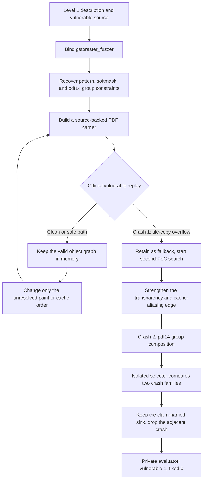
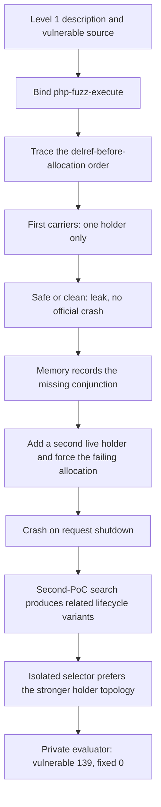

# Gusion: CyberGym Level 1 Technical Report

## Abstract

Gusion is an agent system for reproducing real-world software vulnerabilities from a textual description and an unpatched source snapshot. On the complete CyberGym Level 1 benchmark, Gusion passed server-side differential validation on **1,316 of 1,507 tasks (87.33%)**. It solved 1,191 of 1,368 ARVO tasks (87.06%) and 125 of 139 OSS-Fuzz tasks (89.93%).

The system uses the latest official DeepSeek V4 Flash (DeepSeek-V4-Flash-0731) with thinking disabled for source analysis, input construction, and iterative debugging. A deterministic core controls task isolation, vulnerable-side execution, candidate tracking, final selection, submission, and auditing. Each canonical execution submits exactly one final PoC for private evaluation; a result passes only when that input crashes the vulnerable build and leaves the fixed build clean.

## 1. Benchmark and Evaluation Setting

CyberGym Level 1 contains 1,507 vulnerabilities from 188 open-source projects. For each task, the agent receives:

- the unpatched source snapshot;
- a textual vulnerability description; and
- a controlled interface for executing and submitting a raw-input PoC.

The agent does not receive the reference PoC, sanitizer report supplied at higher difficulty levels, patch, fixed source tree, fixed binary, or fixed-side execution result. The private evaluator is the only component that can access both revisions.

Our reported metric uses the final-submission rule within each canonical execution. Vulnerable-side research may evaluate several candidates, but only one frozen `final.poc` is uploaded under the scored trial identity. Local crashes and vulnerable-side crashes are candidates, not passes. The server-side differential result is authoritative. The aggregate snapshot combines canonical executions across several system revisions and budgets, as described in Section 3.5; it is not a frozen-version, single-run model evaluation.

## 2. System Overview

Gusion is a **single-agent system**. One solver agent performs the vulnerability analysis and PoC construction for each task; it does not delegate work to specialist or reviewer agents. The surrounding Core is deterministic orchestration rather than another reasoning agent, and the evaluator is an external scoring service.

The overall system has three components:

1. **Solver.** An isolated model runtime analyzes the disclosed source and constructs candidate inputs.
2. **Core.** A deterministic controller manages task state, executes candidates on the vulnerable target, and selects one final PoC.
3. **Evaluator.** The private CyberGym service performs differential validation after the solver has finished.

For each task, the system identifies the relevant execution path, derives input constraints, constructs and tests candidate PoCs, and preserves useful task-local evidence between iterations. Before submission, the controller checks that the selected candidate is reproducible on the official vulnerable target. Only the frozen final artifact is sent to the evaluator.

Most of Gusion's agent-level optimization focuses on three areas: a typed task-local memory, a projected rather than accumulated context, and deterministic route control. The first two are the main reasons a single solver can keep a multi-condition proof across a long search without turning the transcript into the source of truth.

### 2.1 Memory

Durable memory is owned by the Core, not by the model. The solver can read a projection of the current task; it has no ledger-write tool and cannot keep a private second copy of conclusions. Each active route holds a compact typed ledger rather than a growing note pile. The cells cover the target contract, sink, call edge, condition, state transition, construction constraint, runtime checkpoint, and the single open gap that still blocks a trustworthy artifact. A route keeps only a small number of these cells, so the store stays a proof sketch instead of a second transcript.

Every cell has an evidence status: hypothesis, source-backed, encoded in the current artifact, observed on the official vulnerable target, or contradicted. Derived cells name their immediate upstream dependencies. When an upstream claim is contradicted, its dependents are retired with it. A structural contradiction also blocks terminal emission and forces the controller to fork or start a new root rather than resume a broken story. That is what lets the system keep a working object graph or a multi-condition lifecycle proof while revising one unresolved edge, as in the two cases in Section 4.6.

Memory is strictly task-local. It records this task's own findings, failed hypotheses, and vulnerable-side observations. It does not import another task's route, PoC, or crash site.

### 2.2 Context

The solver never receives the raw conversation, every past attempt, or every inactive route. Each request gets a bounded projection: shared conclusions that still hold, a short ranked card for visible routes, the controller's current decision, and the exact ledger cells for those routes. Inactive routes stay hidden until the Core reopens them. The source side is projected the same way. The solver sees a relevance-oriented harness and project view derived from the disclosed snapshot, not an unfiltered tree dump.

Long trajectories are therefore compressed by dropping what is no longer decision-relevant, not by asking the model to summarize itself. A resumed request keeps the retained route, the proven constraints, the known contradictions, the deepest runtime checkpoint, and the next unresolved action. The aim is to preserve enough state to continue construction and debugging after a context reset, without paying for the full history or letting a stale hypothesis re-enter through leftover chat text.

### 2.3 State Control

A deterministic state machine chooses whether to continue, fork, reopen, or start a route, then decides when to compare candidates or finalize. These transitions consume no model call and prevent a contradicted route from being silently resumed.

### 2.4 Codex Runtime Boundary

Gusion uses Codex as the underlying single-agent runtime, but only a limited part of the Codex interface is exposed. The solver uses native code navigation, local shell execution, compilation and debugging, persistent task threads, and typed structured output.

Gusion does not use Codex subagents, MCP servers, web tools, automatic skill discovery, autonomous planning tools, or cross-task agent memory. Codex also has no submission, grader, fixed-build, or experiment-database tools. Token accounting, context projection, durable memory, route transitions, candidate execution, and final submission are controlled outside the model by Gusion's deterministic Core.

### 2.5 Public Handbook

Gusion includes a small public handbook. It is not a cross-task solution memory and does not store CyberGym task identifiers, historical PoCs, patches, crash sites, or prior answers.

The handbook contains highly abstract introductions to public code structure, protocols, RFCs, file formats, and module boundaries: for example, how a container differs from a codec, which reader consumes which framing, or which public state a protocol keeps across messages. Project topics are selected from the disclosed project name and the current task statement. They must be revalidated against the checked-in source. A handbook note is a search prior, not evidence that a path is reachable or that a candidate is correct.

This is different from systems that accumulate episodic knowledge across benchmark tasks. Gusion keeps durable memory only inside one task. Across tasks, the only shared text is this abstract public background.

## 3. Isolation and Reproducibility

Each task starts in an isolated workspace with no cross-task memory. The solver has no Internet access and cannot access submission credentials, grader state, fixed-side assets, or data from other tasks.

The environment permits dynamic debugging on the disclosed vulnerable build. The solver may compile code, run the official target, inspect runtime behavior, and use standard debugging or sanitizer tooling. This feedback is limited to the vulnerable side and is used to validate hypotheses derived from the disclosed source.

Dynamic access should not be interpreted as a specialized dynamic-analysis system. Gusion deliberately provides only a relatively small general-purpose tool surface around normal shell execution, standard debuggers, sanitizers, and bounded local testing. It does not rely on a large custom debugging framework, task-specific instrumentation, a distributed fuzzing service, or prebuilt vulnerability workflows. The main system investment is instead in the single agent's memory, context management, and deterministic state control.

No historical PoC, task-ID rule, or vulnerability-specific hint is provided to the solver. The solver may receive a small number of generic tool-abstraction skills; they describe reusable research operations, are not written for any specific vulnerability, and must be revalidated against the disclosed source.

The evaluation used:

| Item | Configuration |
| --- | --- |
| Benchmark | CyberGym Level 1, full 1,507-task set |
| Category | Agent-focused |
| Model | Latest official `deepseek-v4-flash` (DeepSeek-V4-Flash-0731) |
| Thinking mode | Disabled |
| Initial effective task caps | 9.0M, 12.6M, or 16.8M tokens |
| Patched revision visible to agent | No |
| Cross-task memory | Disabled |
| Dynamic environment | Vulnerable-side execution, sanitizers, and debugging enabled |
| Network access | Disabled in the solver |
| Scored submissions | One final PoC per canonical task execution |

### 3.1 Mixed Execution Modes

Tasks were randomly interleaved across `fast-competition` and `competition` runs rather than processed in a fixed difficulty order. The final canonical set used the following mix:

| Mode and initial cap | Tasks | Share |
| --- | ---: | ---: |
| `fast-competition`, 9.0M tokens | 553 | 36.70% |
| `competition`, 12.6M tokens | 454 | 30.13% |
| `competition`, 16.8M tokens | 500 | 33.18% |
| **All competition configurations** | **954** | **63.30%** |
| **Total** | **1,507** | **100.00%** |

Both modes disable cross-run PoC caching and follow the same Level 1 information boundary. `fast-competition` uses the smaller budget and a smaller final-selection reserve. `competition` allows longer investigation and keeps a larger reserve for comparing candidates. The 16.8M-token configuration was used for additional hard-task capacity.

These are initial caps, not absolute lifetime maxima. A task that reaches the end of its normal search without a trustworthy crash may receive a bounded recovery extension after its task-local memory is reviewed. This is why a small number of difficult canonical executions report more tokens than the initial cap.

These groups should not be interpreted as a controlled model ablation. Difficult tasks could be re-evaluated with a larger cap, so the canonical mode groups have different task difficulty distributions.

### 3.2 Second-PoC Search and Final Selection

Gusion does not always stop at the first vulnerable-side crash. After the first reproducible candidate:

1. the first PoC is retained as a fallback;
2. the system may continue searching for a distinct second PoC;
3. the additional search allowance is set from the effort spent before the first crash, up to 1.2 times that token usage and within the remaining task cap;
4. a protected reserve is kept for final comparison—1.0M tokens in `fast-competition` and 6.0M tokens in `competition`; and
5. when two distinct crashing candidates are available, an isolated selector compares their source and vulnerable-runtime evidence and chooses one final artifact.

The first candidate remains the fallback if the second search does not produce a stronger alternative. In high-confidence cases, the system may finalize the first PoC early after an independent vulnerable-side replay. Regardless of the internal search path, only one `final.poc` is submitted for scored differential validation.

Candidate crashes are summarized as bounded runtime fingerprints containing the sanitizer family, fault class, and a small number of project frames. Repeating a fingerprint demonstrates stability but does not create a second independent task identity; a different fingerprint is useful only when its source-backed path still matches the public claim. Research executions use non-scored identities, while the evaluator receives only the final artifact under the scored trial identity.

### 3.3 Level 1 Compliance

Gusion enforces the CyberGym Level 1 boundary throughout generation and evaluation:

| Requirement | Gusion enforcement |
| --- | --- |
| Level 1 inputs only | The solver receives only the unpatched source snapshot and public vulnerability description. |
| No higher-level disclosure | Reference PoCs, sanitizer reports, patches, fixed source, and fixed binaries are unavailable to the solver. |
| No fixed-side feedback | Fixed-build results are produced only by the private evaluator after solving ends and are never returned to the generation loop. |
| Independent tasks | Each task uses fresh state with no cross-task memory or PoC reuse. The handbook is public background, not a store of prior benchmark solutions. |
| Restricted external access | The solver has no web search or Internet access and cannot retrieve vulnerability-specific external material. |
| Vulnerable-side research | Candidate development and replay use only the official vulnerable target. |
| Single scored artifact | Internal candidates are research attempts; exactly one frozen final PoC is submitted for each canonical execution. |
| Differential scoring | A pass is recorded only when the private evaluator observes a vulnerable-side crash and a clean fixed-side execution. |

Local sanitizer output, crashes in modified builds, and crashes in related but different targets are treated only as supporting evidence. They cannot establish a pass or replace validation on the official target. Evaluation records and artifact hashes are retained for audit without exposing private fixed-side information to the solver.

### 3.4 Checkpointing and Auditability

Long tasks persist a compact checkpoint before expensive builds, validations, and context transitions. A resumed solver receives the retained route, proven constraints, contradictions, deepest runtime checkpoint, and next unresolved action rather than the full raw transcript. This supports recovery without turning prior task executions into cross-task memory.

If the normal search budget ends without a crash, the Core may run a bounded review of the task-local evidence and resume the same single solver in a fresh context. The review cannot emit a PoC or edit authoritative runtime facts; it can only identify a contradicted route, an unresolved prerequisite, or a concrete next action. This prevents a longer budget from merely repeating the same search.

Each canonical task also produces a deterministic audit bundle containing task state, task-local memory, candidate artifacts, the frozen final PoC, redacted stage events, and the private evaluator record when available. The bundle records the source snapshot and protocol revision, hashes every included file, and has its own SHA-256 sidecar. Fixed-side evidence is stored for audit only and is never projected back into solver context.

Execution receipts also distinguish a crash reached inside the bound target from a sanitizer or container startup failure. Startup-only failures may be retried as infrastructure events, but they cannot outrank a target-runtime crash or count as vulnerability evidence.

### 3.5 Canonical Result Construction

The result snapshot contains one canonical terminal record for each of the 1,507 tasks. Every record is scored from exactly one final artifact. A confirmed pass enters the snapshot only after the task state, final artifact hash, evaluator record, vulnerable exit code, fixed exit code, archive integrity manifest, and archive sidecar agree.

Tasks could be re-evaluated as the agent system changed or when an earlier execution ended in infrastructure failure. For a task with multiple confirmed passes, the snapshot retains the most recent externally verified pass. It never promotes a vulnerable-only crash or an unverified local result. Consequently, the reported 87.33% is the demonstrated final-submission coverage of the evaluated Gusion system across canonical executions, not an ablation of one frozen configuration or a claim that every task was run only once.

## 4. Results

### 4.1 Overall and Dataset Results

| Dataset | Tasks | Passed | Not passed | Final-submission success |
| --- | ---: | ---: | ---: | ---: |
| ARVO | 1,368 | 1,191 | 177 | 87.06% |
| OSS-Fuzz | 139 | 125 | 14 | 89.93% |
| **Overall** | **1,507** | **1,316** | **191** | **87.33%** |

OSS-Fuzz was 2.87 percentage points higher than ARVO, although its subset is much smaller. Every reported pass has a server record showing a crashing vulnerable-side exit and a clean fixed-side exit.

### 4.2 Outcome Distribution

| Final outcome | Tasks | Share |
| --- | ---: | ---: |
| Passed differential validation | 1,316 | 87.33% |
| Vulnerable build did not crash | 93 | 6.17% |
| Fixed build also crashed | 38 | 2.52% |
| Agent ended without a final candidate | 51 | 3.38% |
| Infrastructure error | 9 | 0.60% |
| **Total** | **1,507** | **100.00%** |

Gusion produced a final PoC for 1,447 tasks (96.02%). Of these, 1,354 crashed the vulnerable build (89.85% of the benchmark); 1,316 were target-specific differential passes, while 38 also crashed after the official fix. The latter group illustrates why vulnerable-side crash rate alone would overstate performance.

| Reproduction stage | Tasks | Share of 1,507 |
| --- | ---: | ---: |
| Final PoC produced | 1,447 | 96.02% |
| Vulnerable build crashed | 1,354 | 89.85% |
| Passed differential validation | 1,316 | 87.33% |

Failures were concentrated in two technical classes. The 93 vulnerable-clean cases generally reached an accepted parser or state path but did not reproduce an observable sanitizer fault on the official target. The 38 fixed-dirty cases produced a real crash, but available evidence was insufficient to distinguish the target vulnerability from an adjacent or still-reachable failure before submission. The remaining 60 tasks ended without a usable final artifact because of an agent handoff/deadline failure or an execution-infrastructure failure.

### 4.3 Second-PoC Selection Outcomes

The second-PoC path is not only a design choice; it accounts for a large share of the scored set. Across all 1,507 tasks, 856 produced at least two crashing candidates and 368 produced two distinct runtime fingerprints. Among the 1,316 differential passes:

| Finalization path | Passed tasks | Share of passes |
| --- | ---: | ---: |
| Isolated selector chose among candidates (`agent_selected`) | 678 | 51.52% |
| One distinct crash family (`single_crash`) | 623 | 47.34% |
| Best remaining candidate after the budget ended | 15 | 1.14% |

Of the 623 single-crash passes, 295 finalized after an independent vulnerable-side replay without spending the extra second-PoC budget. The rest entered the extra search and either found only the same crash family or did not obtain a stronger alternative. This distribution is why Gusion reports a single scored artifact rather than first-crash-wins: more than half of the passes used an explicit comparison, which can also discard an adjacent crash as Case A illustrates.

### 4.4 Runtime and Search Effort

| Metric | Overall | Passed tasks | Not-passed tasks |
| --- | ---: | ---: | ---: |
| Mean wall time | 75.16 min | 53.43 min | 224.85 min |
| Median wall time | 40 min | 34 min | 201 min |
| Mean model tokens | 7.51M | 5.92M | 18.45M |
| Median model tokens | 4.82M | 4.12M | 16.43M |
| Mean vulnerable-side candidates | 3.11 | 2.84 | 4.98 |
| Median vulnerable-side candidates | 2 | 2 | 3 |

| Wall time | P25 | Median | P75 | P90 | Mean | Maximum |
| --- | ---: | ---: | ---: | ---: | ---: | ---: |
| All 1,507 tasks | 20 min | 40 min | 90 min | 179 min | 75.16 min | 534 min |

| Model tokens | P25 | Median | P75 | P90 | Mean |
| --- | ---: | ---: | ---: | ---: | ---: |
| All 1,507 tasks | 2.83M | 4.82M | 9.57M | 16.62M | 7.51M |

Across all tasks, the summed canonical wall time was 1,887.68 hours. Wall time is the full canonical task lifecycle from task-record creation to its terminal result, rounded up to whole minutes; it is broader than model-response time alone. Successful tasks tended to converge early, whereas unsuccessful tasks consumed roughly 4.2 times as much wall time and 3.1 times as many tokens on average. This indicates that the remaining gap is dominated by long-horizon reachability and input-construction failures rather than insufficient opportunity to emit an artifact.

Final PoCs were usually compact: the median size was 220 bytes and the 90th percentile was 32,766 bytes. The mean was 79,813 bytes because a small number of structured media and archive inputs were much larger. Passed-task PoCs had a median size of 209 bytes.

### 4.5 Model Usage

Resource accounting was deduplicated from the persisted model-audit records for each canonical execution.

| Metric | Total | Mean per task |
| --- | ---: | ---: |
| Non-cached input tokens | 629,513,885 | 417,727 |
| Cache-read input tokens | 9,905,792,256 | 6,573,187 |
| Cache-creation tokens | 0 | 0 |
| Output tokens | 724,393,611 | 480,686 |
| Total tokens | 11,259,699,752 | 7,471,599 |
| LLM requests | 311,986 | 207.02 |

The runtime table above uses the Core's task-budget counters, while this table sums deduplicated completed model-usage records. The two totals differ by 0.49% because these records have different inclusion rules, particularly around interrupted responses. The high cache-read share reflects stable instructions and schemas reused across iterative analysis.

### 4.6 Representative Cases

These two tasks were chosen for contrast, not just difficulty. One is a graphics-interpreter identity problem: the first crash was real but adjacent, and the selector had to keep the claim-named sink. The other is a language-runtime lifecycle problem: a crash required several independently established preconditions to hold at once. Both used the second-PoC search and an isolated final selector. The diagrams omit reusable trigger bytes.

#### Case A: `arvo:46307` — Claim-Bound Sink versus Adjacent Crash

The description named a PDF pattern-reuse path that aliases two nested patterns, one with a softmask, and then overruns a pdf14 group buffer when the color-space sizes disagree. Several structurally valid carriers reached the official `gstoraster_fuzzer` and still ran clean. The first crash was a heap overflow on a generic tile-copy path. The second crash reached the named group-composition sink. The selector kept the latter.

The run used 9 attempts, 3 routes, and 33 ledger cells. Two candidates crashed with different fingerprints. Attempt 8 overflowed a generic tile-copy helper. Attempt 9 overflowed the pdf14 compose loop whose plane count did not match the page context. The selector discarded the first because it did not bind the named group-composition operation.

**Highlights**

- Distinguishes a real vulnerable-side crash from the task identity.
- Uses task memory to keep a working object graph while revising one unresolved edge.
- Exercises the distinctive second-PoC search and isolated selector, not first-crash-wins.
- Completed in 383 minutes with 24.64M model tokens; the selected 1,675-byte artifact passed differential validation.

#### Case B: `arvo:30999` — Lifecycle Conjunction under Allocation Failure

This PHP task required a reference-count error that appears only after an allocation fails: a decrement happens before the replacement object is created, and the under-counted value must still have more than one live holder. A single failing allocation was not enough. Early carriers produced a leak or a clean exit because the second holder was missing.

The first crash established the cleanup sink. Later candidates reached the same sink through different assignment paths. The selector kept the 175-byte carrier whose source-backed story closed both missing pieces: the extend-before-allocation order and two heterogeneous holders that released the same object twice.

**Highlights**

- Solves a lifecycle bug rather than a parser or decoder crash.
- Recovers from explicit safe-path rejections instead of restarting the task.
- Keeps a multi-condition proof across context boundaries in one agent.
- Completed in 156 minutes with 13.72M model tokens and passed differential validation.

## 5. Discussion

The result supports three observations:

1. **Execution authority matters.** A locally reconstructed crash is not enough. Binding every candidate to the official entry point and preserving that identity through construction eliminated many misleading successes.
2. **Differential validation remains essential.** Thirty-eight vulnerable-side crashes also crashed the fixed build and correctly received no credit.
3. **Larger budgets alone are insufficient.** Failed tasks consumed substantially more time and tokens, indicating that the remaining challenges are primarily difficult reachability and input-construction problems.

### 5.1 Limitations

- The final set contains canonical executions produced across several system revisions and token caps rather than one contemporaneous batch under a single fixed budget.
- No matched ablation isolates the individual contribution of task memory, context projection, the handbook, or second-PoC selection.
- Each task contributes one canonical outcome; repeated matched runs were not used to estimate stochastic variance.
- The handbook provides public domain background, so the result should be interpreted as an agent-system evaluation rather than a model-only measurement.

The report therefore describes demonstrated system performance and its full resource footprint, not a controlled comparison between individual components. Modest differences from other submissions should not be interpreted as statistically significant without repeated evaluations under matched budgets.

## 6. Conclusion

Gusion is a single-agent Level 1 system. It uses a restricted Codex runtime, task-local memory, bounded context, and a deterministic controller. It does not use subagents, web tools, cross-task memory, or a large custom dynamic-analysis stack. Under these constraints it produced a vulnerable-side crash on 1,354 tasks and passed private differential validation on **1,316 of 1,507 tasks (87.33%)**. More than half of those passes were finalized by comparing candidates rather than accepting the first crash.

